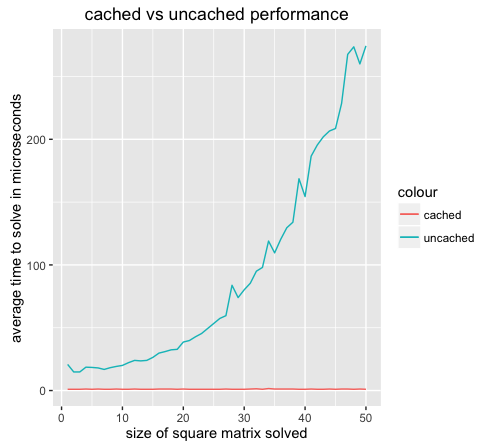

Hi, fellow students!

Thanks for taking the time to assess my work. Hope you're enjoying the course!

If you are interested, there is a plot of how much faster here caching makes things [(click for more detail)](cachedVsUncachedPlotThumb.png)

I've also written some automated tests in cachematrix.tests.R, and the code to generate the plot is at cachematrix.plot.R.

